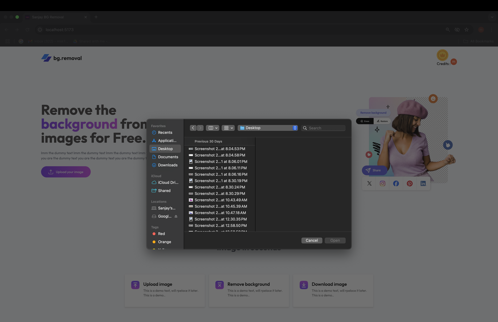

# 🧼 Sanjay BG Remover — Full-Stack AI SaaS Platform

A full-stack AI-powered SaaS application that allows users to remove image backgrounds with ease. Built with React.js and Node.js, this platform includes secure Clerk-based authentication, Stripe integration for payments, and a credit-based usage system.

---

## 🚀 Features

- 🔒 Secure authentication with Clerk
- 🖼️ Background removal using AI
- 💳 Stripe payments with credit tracking
- 📤 Image upload and preview interface
- 🔔 Real-time feedback with toast notifications
- 🧩 Built with modular, scalable architecture

---
## 🎬 Live App Walkthrough


---

## 📸 Screenshots

| Login Page | Home Page | Upload Interface |
|------------|-----------|------------------|
|  |  |  |


---

## 🧰 Tech Stack

**Frontend:**  
- React.js  
- Tailwind CSS  
- Vite  
- React Router DOM  
- React Toastify  

**Backend:**  
- Node.js  
- Express.js  
- MongoDB  
- Clerk Authentication  
- Stripe API

---

## 📦 Installation

```bash
# Clone the repository
git clone https://github.com/mandrusanjay123/Image_Background_Remover.git
cd Image_Background_Remover

# Navigate to client and install dependencies
cd client
npm install

# Start the development server
npm run dev
